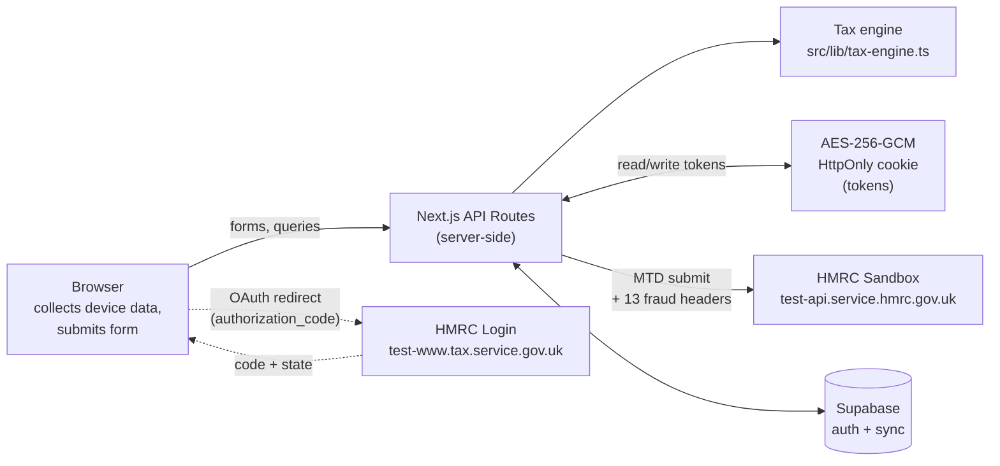

# EasyAcco

UK Self Assessment + Making Tax Digital app for the **2026/27** tax year. End-to-end integrated with HMRC's MTD sandbox — OAuth2 authorization-code flow, full Fraud Prevention Headers, real MTD-IT and MTD-VAT return submission.

**Live:** [easyacco.uk](https://easyacco.uk) · **Stack:** Next.js 16 (App Router) · React 19 · TypeScript · Tailwind · Supabase · Vitest

---

## What's in the box

| Area | What it does | Where it lives |
| --- | --- | --- |
| **Tax engine** | 2026/27 UK personal tax — Income Tax, Class 1/2/4 NI, dividend tax, student loans (Plans 1/2/4/5/PG), Scottish bands, PA taper, 60% trap detection | `src/lib/tax-engine.ts` |
| **HMRC MTD-IT** | Submit Self-Employment periodic summary (quarterly) to HMRC sandbox with all 13 required Fraud Prevention Headers | `src/app/api/hmrc/mtd/it/submit/` |
| **HMRC MTD-VAT** | Submit 9-box VAT return with client-side arithmetic invariants pre-validated before send | `src/app/api/hmrc/mtd/vat/submit/` |
| **OAuth2 flow** | Authorization-code with CSRF `state`, AES-256-GCM encrypted HttpOnly cookie token storage, auto-refresh 60s before expiry | `src/app/api/hmrc/auth/` |
| **Validation page** | Public `/validation` — five HMRC 2026/27 scenarios worked by hand alongside live engine output, every assertion side-by-side | `src/app/validation/page.tsx` |
| **Dashboard** | Invoices, expenses, P&L, tax estimator, MTD submission panels with full audit pane showing exact fraud headers sent | `src/app/dashboard/` |

---

## Why the HMRC piece matters

Most hobbyist HMRC projects skip **Fraud Prevention Headers** entirely. HMRC **rejects production submissions** without them — they require `Gov-Client-*` and `Gov-Vendor-*` headers describing the originating user, device, software, and network path. EasyAcco implements the full 13-header set required for a `WEB_APP_VIA_SERVER` connection (the other 3 are excluded by spec — see [`docs/HMRC.md`](docs/HMRC.md#fraud-prevention-headers-phase-3)).

Browser-side data (user agent, screens, window size, timezone, deviceId) is collected client-side and POSTed in the request body. The server merges it with server-only data (client IP from `x-forwarded-for`, vendor IP from `HMRC_VENDOR_PUBLIC_IP`) and emits the final header set. Each submission's headers are surfaced back to the dashboard for audit.

---

## Architecture



**Trust boundary:** `HMRC_CLIENT_SECRET`, `HMRC_COOKIE_SECRET`, and tokens never reach the browser. The cookie encryption secret and the client secret are independent — stealing the cookie alone yields ciphertext only.

---

## Security model

- **Secrets server-side only.** Client secret + cookie secret live in env vars. Browser never sees them.
- **Token storage.** Access + refresh tokens go into an HttpOnly cookie encrypted with **AES-256-GCM**. The auth tag means any byte-flip causes `decrypt()` to return `null` — tampered bytes can never silently flow into the OAuth client.
- **CSRF protection.** A 32-byte random `state` is set as an HttpOnly cookie AND included in the authorize redirect URL. The callback rejects requests where URL `state` ≠ cookie `state` (constant-time compare).
- **Token refresh.** Refresh tokens last 18 months; access tokens 4h. The server refreshes 60s before expiry to avoid 401 races.
- **Local-first data.** User invoices/expenses sit in IndexedDB; cloud sync via Supabase encrypts payloads with AES-GCM (256-bit, Web Crypto API) before write.

---

## Engine validation

[`/validation`](src/app/validation/page.tsx) is a public page showing five worst-case UK 2026/27 scenarios — each is worked out **by hand in plain arithmetic** alongside the live engine's output, with every numerical assertion checked to the penny:

1. **60% tax trap** — self-employed at £110,000 (PA taper inside 40% band → 60% effective marginal rate)
2. **PA fully tapered** — £125,140 ceiling of the trap
3. **Scottish starter rate** — £15,000 at 19% (Scotland has six bands, not three)
4. **Director optimal mix** — £12,570 salary + £50,000 dividends (canonical limited-company structure)
5. **Additional rate + dividends** — £160,000 SE + £10,000 divs (three-band income tax + 39.35% dividend additional rate + full Class 4 NI)

Computed server-side on every request — no stale snapshots.

---

## Quick start

```bash
git clone https://github.com/fionadbarad/easyacco
cd easyacco
npm install
cp .env.example .env.local   # fill in Supabase + HMRC keys
npm run dev
```

Open <http://localhost:3000>. For the HMRC sandbox walkthrough (registering an app on Developer Hub, creating test users, end-to-end OAuth + MTD submission), see [`docs/HMRC.md`](docs/HMRC.md).

### Tests

```bash
npm test                # vitest, full suite
npm run test:watch      # watch mode
npx tsc --noEmit        # strict typecheck
npm run build           # production build
```

---

## Project structure

```
src/
├── app/
│   ├── api/hmrc/           # HMRC sandbox integration routes
│   │   ├── auth/           # OAuth2 start, callback, disconnect
│   │   ├── hello/          # Phase 1 connectivity probe
│   │   ├── me/             # /hello/user with auto-refresh
│   │   ├── status/         # Connection state (no tokens leaked)
│   │   └── mtd/{it,vat}/   # Phase 3 MTD submissions
│   ├── dashboard/          # Authenticated app surface
│   │   └── hmrc/           # HMRC connection + submission UI
│   └── validation/         # Public engine-validation page
├── lib/
│   ├── tax-engine.ts       # Pure UK 2026/27 tax calculations
│   ├── hmrc/
│   │   ├── oauth.ts        # Token exchange + refresh
│   │   ├── fraud-headers.ts# Fraud Prevention Header builder (13 headers)
│   │   ├── mtd-errors.ts   # HMRC coded errors → human messages
│   │   ├── cookies.ts      # Encrypted cookie read/write
│   │   └── crypto.ts       # AES-256-GCM encrypt/decrypt
│   └── storage/            # IndexedDB + Web Crypto AES-GCM sync
└── features/               # Modular feature surfaces (invoices, expenses, P&L)
```

---

## Documentation

- [`docs/HMRC.md`](docs/HMRC.md) — HMRC sandbox setup, per-phase walkthrough, security model details, full endpoint table
- [`AI_WORKFLOW.md`](AI_WORKFLOW.md) — engineering process: how AI was used to translate HMRC spec → code, where it was wrong and got caught

---

© 2026 Fiona Barad
